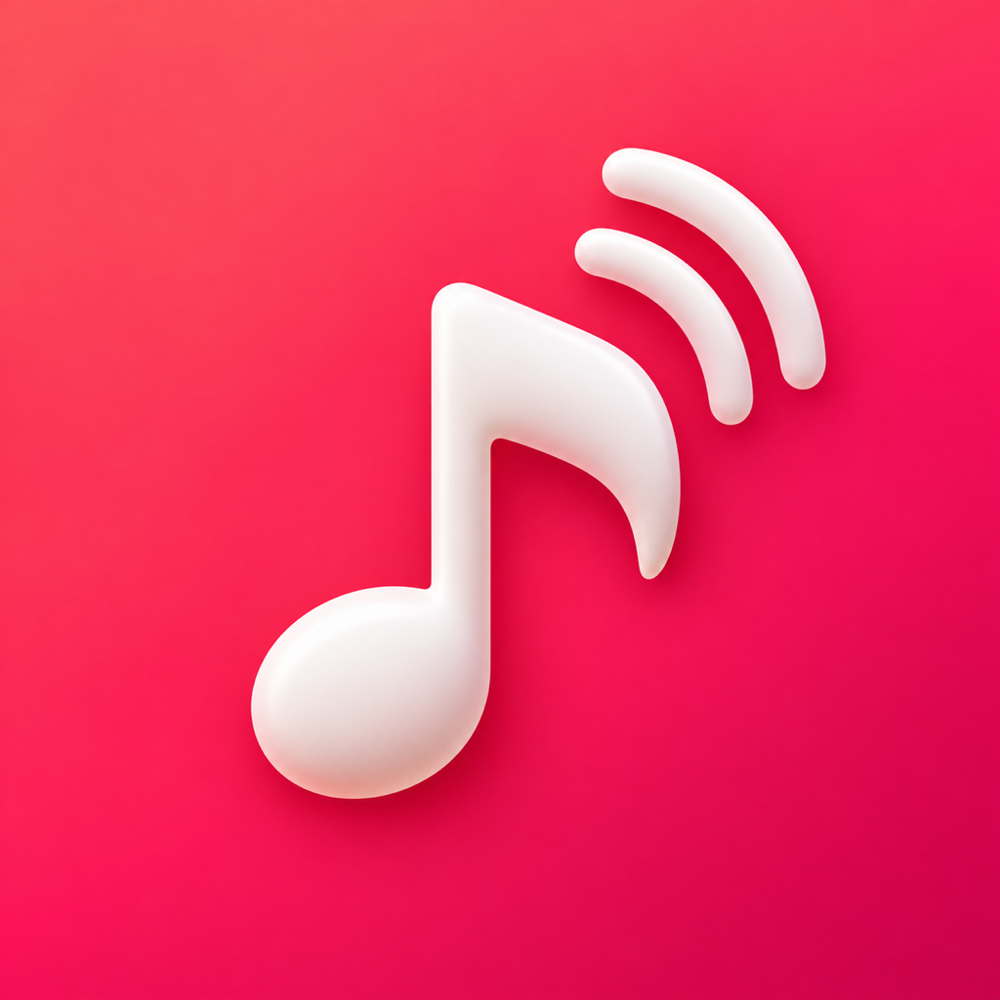
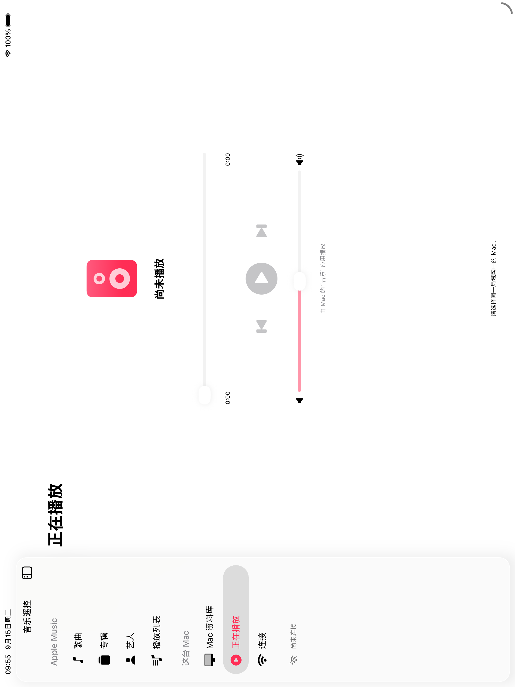

# Modern Remote — MVP



A native SwiftUI iPhone remote for **Music.app on your Mac**. No hosted server, account system, password collection, package dependencies, or audio forwarding.

Open `ModernRemote.xcodeproj`. Shared schemes: **ModernRemoteMac** and **ModernRemoteiOS**. Requires iOS 17+, macOS 14+, and Xcode 16+ with the iOS SDK. Chinese setup instructions: `README.zh-CN.txt` (strict GBK).

## Run

The current interface uses Simplified Chinese. Main labels: 连接 (Connect), 资料库 (Library), Mac 资料库 (Mac Library), 正在播放 (Now Playing), 开启共享 (Start sharing), 配对码 (Pairing code), 允许访问 Apple Music (Allow Apple Music), 加载 Mac 资料库 (Load Mac library).

1. In Xcode, select each target → Signing & Capabilities. Choose your development team and replace both `com.example.modernremote.*` bundle identifiers with your own unique identifiers.
2. Enable **MusicKit** for the iOS app identifier in Apple Developer Certificates, Identifiers & Profiles. Refresh automatic signing/profiles. The supplied iOS entitlement is `com.apple.developer.music-user-token`. A team/profile supporting this service is required for MusicKit; signing failures are not solved by entering an Apple ID password in this app. No developer private key belongs in the project.
3. Run **ModernRemoteMac** on My Mac. Open Music.app, sign in as needed, and verify a song plays there. Click **Start sharing** and allow macOS Automation access to Music. Allow local network access if prompted. Keep the companion running.
4. Run **ModernRemoteiOS** on a physical iPhone using Xcode. Connect it to the same LAN as the Mac. In **Connect**, allow Local Network access, select your Mac and enter its four-digit pairing code from the Mac window. There is no sign-in form; MusicKit uses system authorization for the iPhone's existing music account.
5. **Library → Allow Apple Music** loads songs and playlists. Browse Songs / Albums / Artists / Playlists or search. Tap a song to play it on the Mac. If it cannot be uniquely matched, use **Mac Library → Load Mac library** and select the exact Mac track.
6. **Now Playing** provides play/pause, previous/next, seek and Music.app volume. Playback state is refreshed every two seconds while the iOS app is active. The iPhone does not play audio.
7. Stop sharing on the Mac to disconnect and revoke the pairing code. Restart sharing and pair again to reconnect.

For a local Mac-only build with Command Line Tools (no full Xcode required):

```sh
./Scripts/build-mac.sh
open .build/ModernRemoteMac.app
```

This produces a locally ad-hoc signed app for the current CPU architecture. It is not a notarized distribution build. Rebuilding/changing identity can require granting Automation permission again. The Mac target intentionally does not use App Sandbox for this prototype; it enables Hardened Runtime and Apple Events automation. App Store distribution would require a separate sandbox/entitlement review.

## What works and what is deliberately limited

| Capability | MVP behavior |
|---|---|
| iPhone library | MusicKit `MusicLibraryRequest<Song>` and `<Playlist>`, with pagination. Albums/artists are grouped from loaded song metadata, not a separate catalog browser. Compilations can split by track artist. |
| Playlists | Fetch library tracks with `preferredSource: .library`, including subsequent batches; omit music videos. Tap individual songs. No playlist editing or whole-playlist queue replacement. |
| Search | Local substring search of fetched library metadata. Mac search covers only pages you have loaded. No Apple Music catalog search. |
| Specific song on Mac | Prefer exact Mac persistent ID. iPhone library IDs are never treated as Mac IDs. Cloud/iPhone selections require one unique Mac title/artist/album match, with duration tolerance when available. Missing/ambiguous matches produce an error; add/sync the song on Mac or use Mac Library. |
| Unsynced local songs | iPhone MusicKit cannot see Mac-only files. Mac Library reads Music.app directly in pages of 200 and plays by persistent ID. Mac-only playlists are not exposed in this MVP. |
| Current playback | Title, artist, state, position, duration and Music.app volume via AppleScript. No Mac artwork retrieval in MVP. |
| Up Next | Full Music.app queue is not read or edited. Previous/next operate on Music.app's existing context. Selecting a song does not promise to enqueue the entire album/playlist. |
| Cloud playback | Music.app must itself have access to the selected track, a suitable account/subscription where applicable, and internet for streams. DRM audio is never downloaded or transferred by this app. |
| Background/lifecycle | Mac stays running and awake. No background entitlement keeps the iPhone socket alive indefinitely. Reopen and reconnect after suspension/network changes; no automatic reconnection or key persistence. |
| Large libraries | iPhone loads all available song pages in memory. Mac uses small pages, but synchronous AppleScript can briefly stall the Mac window on very large/slow libraries. Library changes during offset pagination can require a reload/reconnect. |

**Important API correction:** native macOS is not listed as a supported platform for `SystemMusicPlayer` in Apple's documentation inspected for this project. Mac Catalyst support is not native macOS support and does not establish a cross-device Music.app control API. This implementation uses the installed Music.app scripting dictionary rather than pretending `SystemMusicPlayer.shared` can control native Mac Music. `ApplicationMusicPlayer` would change the playback owner, so it is not used here.

## Architecture and permissions

- `Shared/Protocol.swift`: versioned Codable JSON messages, request IDs and bounded newline framing (1 MiB).
- `Shared/Transport.swift`: Bonjour `_modernremote._tcp`, Network.framework TCP + TLS 1.2 PSK with AES-128-GCM. A random four-digit pairing code provides mutual authentication and encryption; it is not sent as a JSON password. Leading zeros are preserved (for example, `0386`), and stopping sharing generates a different code. The ephemeral code is never persisted. Five failed handshakes within 60 seconds trigger a 60-second cooldown. A four-digit TLS PSK has only 10,000 possibilities; the cooldown limits online attempts, not offline guessing from a captured handshake. This convenience mode assumes a trusted personal LAN. One controller at a time; a 15-second handshake deadline bounds idle connection attempts. A peer on the LAN can still temporarily occupy the single handshake slot: this is a personal LAN prototype, not a hardened multi-user service.
- `Mac/MusicBridge.swift`: fixed AppleScript operations with validated numbers and escaped string arguments; library paging, unique-match resolution, status and controls.
- `Mac/MacApp.swift`: sharing UI, key rotation, listener and request dispatch.
- `iOS/LibraryStore.swift`: MusicKit authorization and library paging.
- `iOS/RemoteClient.swift`: discovery, connection, correlated requests, 30-second response timeout and polling. One outstanding request; while busy, at most one subsequent user command is kept (latest wins), never an unbounded queue.
- `iOS/RemoteApp.swift`: four tabs, responsive SwiftUI layout and system artwork loading. UI, accessibility labels, connection messages and permission descriptions are Simplified Chinese. Apple Music and other product names remain unchanged. The first screen is Connect (连接). System-provided error details may follow the OS language.
- `Config/*-Info.plist`: Music usage, Apple Events usage, Bonjour and local-network descriptions. No background audio mode or ATS exemption.
- `Config/*.entitlements`: iOS MusicKit; macOS Apple Events automation. No unrelated permissions.

## Build and release status

Release v0.2.0 is an early MVP, with Simplified Chinese UI and four-digit pairing.

- Native Mac Release and iPhoneOS Release builds compile using Xcode 26.3.
- The iOS Simulator build launches on iPhone 17 Pro Max (iOS 26.3). Bonjour discovery and TLS pairing with a real Mac companion were verified before the four-digit revision.
- The current four-digit revision passes protocol tests covering code validation, leading zeros, rotation, failed-attempt cooldown, actual loopback TLS request/reply and wrong-code rejection.
- Music.app AppleScript bodies compile against the installed scripting dictionary.
- Actual MusicKit account authorization, song playback, large libraries, and signed physical-iPhone installation still need end-to-end verification.

GitHub Releases include an ad-hoc signed Apple-silicon Mac app ZIP and an **unsigned iPhoneOS IPA**. Re-sign the IPA with your own certificate and provisioning profile before installing it. MusicKit access additionally depends on a profile/App ID supporting the MusicKit entitlement; successful IPA signing alone does not establish that capability. Mac Library is the alternative browsing path.

`Scripts/build-ios.sh` reproduces the unsigned IPA. Select your full Xcode toolchain or set `DEVELOPER_DIR` before building. The Mac app is not notarized. No signing certificates, private keys, accounts, live pairing codes, build logs or personal library data are included.

Run the protocol/security checks with `./Scripts/test.sh`.

### Device acceptance checklist

- Build both schemes; pair on a real iPhone; verify the Mac name and allow both permissions.
- Try an incorrect key: no commands or library data should be accepted.
- Play a unique synced song, pause/resume, skip, seek and adjust volume; confirm audio comes from Mac Music.app.
- Browse a Mac-only local song and play it by its Mac ID.
- Try a missing or duplicated metadata match: display an error, never select an arbitrary candidate.
- Use a playlist with over 200 tracks and a Mac library with over 200 tracks to verify additional pages.
- Stop/restart sharing: old key fails; new key succeeds. Change Wi-Fi or suspend iPhone; reconnect manually.

## Troubleshooting

- **Signing fails:** choose a team and unique IDs; enable the MusicKit App ID service and regenerate provisioning profiles. No Apple account credential should be pasted into source.
- **No Mac found:** start sharing, confirm same subnet, disable Wi-Fi client isolation/guest separation, allow incoming app connections in Mac firewall and local-network access on both devices. Discovery retry is in Connect.
- **Automation denied / error -1743:** System Settings → Privacy & Security → Automation → allow ModernRemoteMac to control Music. Relaunch after granting permission.
- **MusicKit denied:** iOS Settings → Privacy & Security → Media & Apple Music. After allowing access, tap Reload library.
- **No unique match:** use Mac Library or add/sync that version in Mac Music. Library IDs are device/service scoped; matching does not cover every catalog/version case.
- **Timeout:** ensure Music.app is responsive and the Mac awake, then reconnect. Commands are not automatically replayed after timeout because they may already have executed.

## Primary references

- [SystemMusicPlayer availability](https://developer.apple.com/documentation/musickit/systemmusicplayer)
- [MusicKit setup and authorization](https://developer.apple.com/musickit/)
- [MusicLibraryRequest](https://developer.apple.com/documentation/musickit/musiclibraryrequest)
- [Explore more content with MusicKit, WWDC22](https://developer.apple.com/videos/play/wwdc2022/110347/)
- Music.app scripting definitions installed locally at `/System/Applications/Music.app/Contents/Resources/com.apple.Music.sdef`.

Source and machine-readable project files use UTF-8 as expected by Xcode. The Chinese plain-text guide is GBK, checked with strict encoding and round-trip decoding.

Four-digit pairing revision: the Mac displays four large digits; iPhone uses a visible four-character numeric field and number pad, and enables device selection only after four digits are entered. Tests include leading zeros, malformed input, non-repeating code rotation, cooldown, encrypted round-trip and wrong-code rejection.

Version 0.1.1 adds the custom music-and-wireless app icon to iPhone, iPad and Mac builds, including the standalone Mac script. Icon declarations and compiled resources were verified inside both Release app bundles.

## iPad layout (v0.2.0)

On regular-width iPad windows, NavigationSplitView provides a sidebar for Songs, Albums, Artists, Playlists, Mac Library, Now Playing and Connect. Library pages keep a bottom playback bar, allowing playback controls without leaving the list. The full player has a bounded width and scrolls on short windows. Narrow windows use the compact tab layout; connection input and selected destination live above the adaptive layout. iPhone continues to use tabs.

The iPad Pro 13-inch simulator was visually checked in portrait and landscape. Opening the player from the bottom bar was verified. iPad multitasking window sizes, hardware-keyboard navigation, full accessibility and real-device playback are not yet exhaustively tested.


